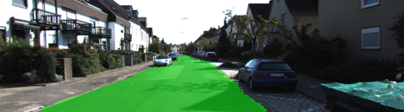
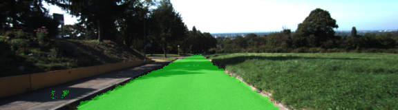
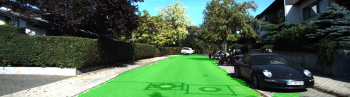
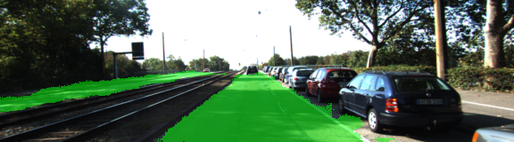
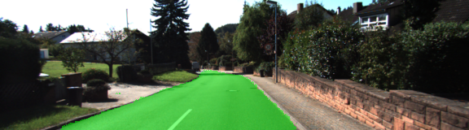

# Semantic Segmentation
### Introduction
Label the pixels of a road in images using a Fully Convolutional Network (FCN).

### Implementation
We used layers 3, 4 and 7 of a pre-trained VGG16 network to create skip layers for a fully convolutional network based on the analysis here [Fully Convolutional Networks for Semantic Segmentation](https://arxiv.org/pdf/1605.06211.pdf). The training classes are [road, not-road]. The optimizer chosen is Adam optimizer, and the loss function is cross-entropy. Every convolution and transpose layer includes L2 regularization. 

### Hyper Parameters
- epochs: 60
- batch size: 5
- learning rate: 0.0007
- keep prob: 0.5

### Dataset
[Kitti Road dataset](http://www.cvlibs.net/datasets/kitti/eval_road.php). Using what's inside `data_road` directory as the training and test images.

### Run
Run the following command to run the project:
```
python main.py
```

### Result
The total loss of epochs decreased per every iteration. The loss of first epoch is 1.256, while the loss of the 60th epoch is 0.00579. Therefore, the combination of the hyper parameters chosen is reasonable.

#### Samples







